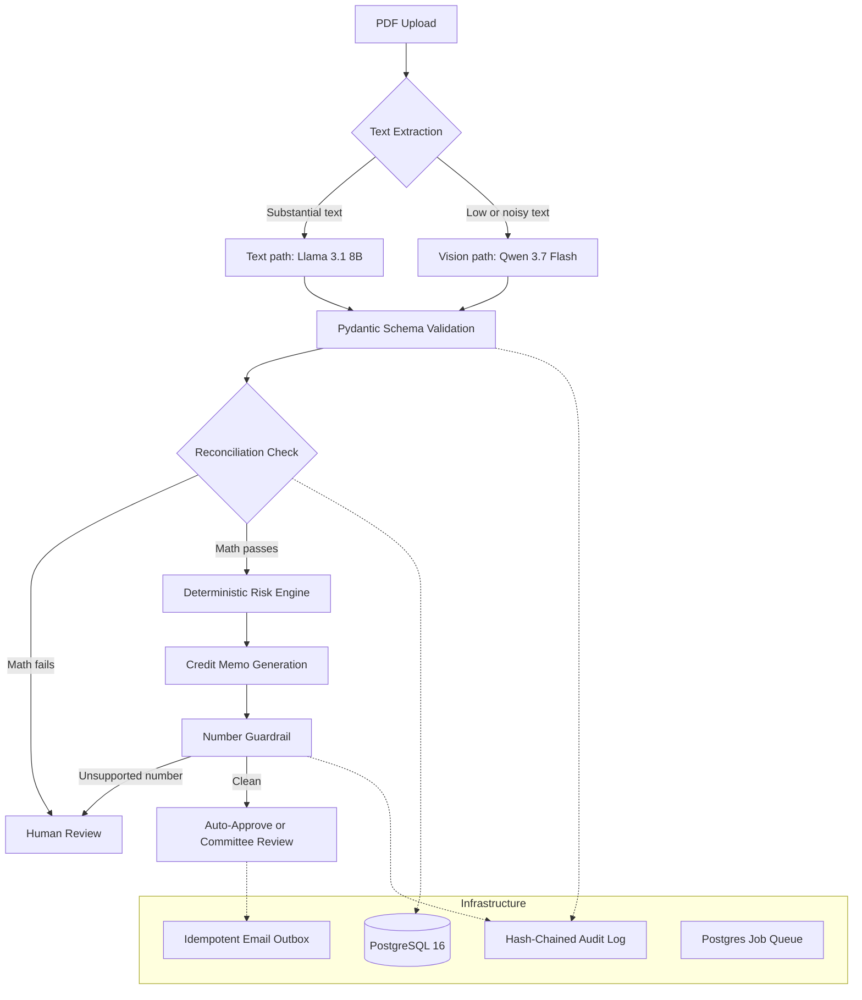

<div align="center">

# UnderwriteOS

### Deterministic Document Underwriting Platform

**LLMs extract and narrate. Deterministic, audited, tested code decides.**

[](https://github.com/MUmer007/UnderwriteOS/actions)
[](https://www.python.org/downloads/)
[](https://fastapi.tiangolo.com/)
[](https://www.postgresql.org/)
[](https://github.com/langchain-ai/langgraph)
[](https://github.com/astral-sh/ruff)
[](LICENSE)

[Overview](#1-overview) · [Architecture](#3-architecture) · [Evaluation](#6-evaluation) · [Security](#7-security-and-threat-model) · [Quick Start](#9-getting-started) · [Limitations](#12-limitations-and-non-goals)

</div>

---

## Document Control

| | |
| :--- | :--- |
| **Project** | UnderwriteOS |
| **Type** | Reference implementation / engineering portfolio project |
| **Status** | Complete (8-week solo build). Not production-certified. |
| **Owner** | Umer ([@MUmer007](https://github.com/MUmer007)) |
| **Runtime** | Python 3.12, PostgreSQL 16, Docker |
| **License** | MIT |
| **Data** | 100% synthetic. No real customer data or PII is used anywhere in this repository. |

---

## Contents

1. [Overview](#1-overview)
2. [Key Metrics](#2-key-metrics)
3. [Architecture](#3-architecture)
4. [Components](#4-components)
5. [Design Decisions](#5-design-decisions)
6. [Evaluation](#6-evaluation)
7. [Security and Threat Model](#7-security-and-threat-model)
8. [Reliability and Auditability](#8-reliability-and-auditability)
9. [Getting Started](#9-getting-started)
10. [Testing and CI](#10-testing-and-ci)
11. [Repository Structure](#11-repository-structure)
12. [Limitations and Non-Goals](#12-limitations-and-non-goals)
13. [Roadmap](#13-roadmap)
14. [Engineering Takeaways](#14-engineering-takeaways)
15. [Contributing and Support](#15-contributing-and-support)
16. [License](#16-license)

---

## 1. Overview

### Problem

Financial document underwriting is slow, manual, and hard to audit. The obvious LLM shortcut, asking a model for a risk assessment, fails where it matters most. Models misread digits, fabricate figures, follow instructions embedded in documents, and leave no verifiable record of what happened.

### Approach

UnderwriteOS treats the LLM as an **untrusted component**. Models are confined to two narrow jobs, and everything that carries risk is handled by deterministic code.

| Principle | Enforcement |
| :--- | :--- |
| **Models extract and narrate only** | LLMs convert PDFs to structured fields and convert computed metrics into memo prose. They never produce a risk number or a decision. |
| **Risk math is deterministic** | A `Decimal`-only engine computes every metric. It is unit-tested and makes no model calls. |
| **Extraction is verified** | Extracted transactions must reconcile arithmetically against stated balances, or the deal is routed to human review. |
| **Narration is verified** | A number guardrail checks every figure in a generated memo against engine outputs and blocks unsupported values. |
| **History is tamper-evident** | State changes are recorded in a hash-chained audit log. |
| **Measurement comes first** | The evaluation harness was built in Week 1, and changes were measured against it throughout. |

---

## 2. Key Metrics

Measured on 90 synthetic documents (60 clean, 15 tampered, 15 wrong-type). Methodology and caveats are in [Section 6](#6-evaluation).

| Metric | Result |
| :--- | :--- |
| Tamper detection (deterministic reconciliation) | **15 / 15** |
| Wrong-type rejection | **15 / 15** |
| Adversarial payload classes blocked or flagged | **6 / 6** |
| Average transaction-level F1 (zero-shot baseline) | **53.79%** |
| Latency per document | p50 ≈ 2.5 s, p90 ≈ 5.0 s |
| Cost per document | < $0.001 (free / low-cost OpenRouter models) |

> **Reading these numbers.** Extraction accuracy is a modest zero-shot baseline by design of the experiment. System safety does not depend on extraction being perfect: inaccurate extractions fail reconciliation and are escalated to a human rather than producing a wrong decision.

---

## 3. Architecture



### Trust boundaries

| Zone | Contents | Trust level |
| :--- | :--- | :--- |
| **Untrusted input** | Uploaded PDFs, including any embedded text or images | None |
| **Untrusted compute** | LLM extraction and memo generation | None. Output is validated before use. |
| **Verification layer** | Pydantic schemas, reconciliation, number guardrail | Deterministic, tested |
| **Trusted core** | Risk engine, decision routing, audit log, outbox | Deterministic, tested, audited |

### Pipeline stages

1. **Ingest.** Uploads are stored and enqueued in a Postgres-backed job queue.
2. **Route.** PyMuPDF and pdfplumber test for usable embedded text. Text-rich documents take the text path, and scanned or degraded documents take the vision path.
3. **Extract and classify.** The model returns structured JSON that is validated against a strict Pydantic schema. Wrong-type documents are rejected here.
4. **Reconcile.** Arithmetic checks confirm that extracted transactions tie out to stated balances. This is the primary defense against both model error and tampering.
5. **Score.** The `Decimal` risk engine computes metrics such as DSCR and volatility.
6. **Narrate.** An LLM drafts a credit memo from the computed metrics.
7. **Guard.** The number guardrail compares every figure in the memo to engine outputs. Any unsupported figure flags the deal.
8. **Route and notify.** A composite confidence score selects auto-approval or human/committee review. Notifications go through an idempotent outbox.

---

## 4. Components

| Component | Path | Responsibility |
| :--- | :--- | :--- |
| API and review UI | `src/uw/api/` | FastAPI endpoints and server-rendered Jinja2/HTMX interface for underwriters |
| Workflow | `src/uw/agents/` | LangGraph state machine: classify, extract, reconcile, risk, guardrail |
| Extraction | `src/uw/extraction/` | Dual-path extraction (text and vision) |
| Risk engine | `src/uw/risk/` | Deterministic, `Decimal`-only metric computation |
| Guardrails | `src/uw/guardrails/` | Number guardrail for generated memos |
| Audit | `src/uw/audit/` | Hash-chained, tamper-evident event log |
| Queue | `src/uw/queue/` | Postgres job queue using `FOR UPDATE SKIP LOCKED` |
| Email outbox | `src/uw/email/` | Effectively-once delivery via `ON CONFLICT` |
| LLM client | `src/uw/llm/` | OpenAI-compatible client with retry logic |
| Data generation | `datagen/` | Synthetic statements, tampered variants, adversarial PDFs |
| Evaluation | `evals/` | Harness, report generator, confidence calibration |

The reviewer interface is server-rendered with HTMX, so it needs no client-side build step. It shows color-coded reconciliation status, a three-column grid of deterministic risk metrics, and inline warnings when a memo violates the number guardrail.

---

## 5. Design Decisions

| Decision | Rationale | Trade-off |
| :--- | :--- | :--- |
| Deterministic `Decimal` risk engine | Auditable, reproducible, no floating-point drift, unit-testable | Metrics are simplified (see [Section 12](#12-limitations-and-non-goals)) |
| Reconciliation as the primary gate | Verifies internal consistency without needing ground truth at runtime | Catches inconsistent documents, not internally consistent forgeries |
| Postgres as queue | Job state is transactional with business data; no extra infrastructure | Not designed for very high throughput |
| Outbox with `ON CONFLICT` | Effectively-once delivery across retries and crashes | Adds a table and a worker loop |
| Hash-chained audit log | Any edit to history breaks the chain | Provides tamper-evidence, not authenticity |
| LangGraph orchestration | Explicit, inspectable state machine instead of an open-ended agent loop | More structure than a simple script |
| Dual extraction paths | Text is cheaper and more accurate; vision covers scanned or degraded files | Two paths to test and maintain |
| HTMX and Jinja2 over a SPA | An internal review tool needs little client-side state | Less suited to complex client interactions |
| Open-source models via OpenRouter | Low cost, no vendor lock-in for the core pipeline | Free-tier rate limits |

---

## 6. Evaluation

### Methodology

| Item | Detail |
| :--- | :--- |
| Dataset | 90 synthetic documents from `datagen/`: 60 clean bank statements, 15 tampered (altered amounts), 15 wrong-type (invoices) |
| Extraction metric | Field-level transaction precision, recall, and F1 against generator ground truth |
| Safety metrics | Tampered-document flag rate and wrong-type rejection rate |
| Reproduce | `uv run python evals/run.py`, then `uv run python evals/generate_report.py` |

### Results

| Metric | Result |
| :--- | :--- |
| Average transaction F1 (zero-shot, noisy PDFs) | 53.79% |
| Tamper detection | 100.00% (15/15) |
| Wrong-type rejection | 100.00% (15/15) |
| Median latency (p50) | ~2.5 s per document |
| 90th percentile latency (p90) | ~5.0 s per document |
| Cost per document | < $0.001 |

**Extraction performance by path**

| Path | Documents | Avg F1 |
| :--- | :--- | :--- |
| Text (pdfplumber) | 45 | 62.4% |
| Vision (PyMuPDF raster) | 45 | 45.1% |

### Confidence calibration

A composite confidence score (reconciliation outcome, field-level F1, extraction path) controls automation. `evals/calibration.py` sweeps the auto-approve threshold.

| Threshold | Auto-Approve Rate | Error Rate | Precision |
| :--- | :--- | :--- | :--- |
| 0.40 | 30% | 0.00% | 100.00% |
| 0.50 | 23% | 0.00% | 100.00% |
| 0.70 | 18% | 0.00% | 100.00% |
| 0.90 | 17% | 0.00% | 100.00% |

Raising the threshold trades automation for conservatism. The auto-approved set is small at every threshold, so the 0% error rate shows the gating logic behaves sensibly on this dataset. It is not a production accuracy guarantee.

### Evaluation caveats

- All data is synthetic. Real statements have more varied layouts, and results will not transfer one-to-one.
- The tamper set consists of arithmetic alterations that break reconciliation. A forgery that keeps the math consistent would pass reconciliation.
- Sample sizes are small (15 per adversarial class), so 100% rates carry wide uncertainty.

---

## 7. Security and Threat Model

### Assets and threats

| Threat | Vector | Mitigation |
| :--- | :--- | :--- |
| Prompt injection | Hidden instructions in a document (white text, 1 pt text, image-embedded text) | Model output is consumed only as schema-validated fields. Decisions are made by deterministic code, so injected text has no path to authority. |
| Document tampering | Altered amounts in a statement | Arithmetic reconciliation against stated balances |
| Document-type spoofing | Invoice presented as a bank statement, or contradictory hidden metadata | Classification during extraction; wrong-type documents are rejected |
| Model hallucination | Fabricated figures in a generated memo | Number guardrail blocks any figure not traceable to engine output |
| Audit-log alteration | Editing recorded history | Hash chain makes modification detectable |
| Duplicate side effects | Retried jobs re-sending email | Idempotent outbox |

### Red-team results

Six adversarial payload classes live in `tests/adversarial/` and are generated by `datagen/`.

| Payload | Attack | Outcome |
| :--- | :--- | :--- |
| White-text injection | Hidden "approve this deal" text | Ignored |
| Tiny-text injection | Instructions at 1 pt | Blocked |
| Image-embedded injection | Command text in an image for the vision model | Not executed |
| Contradictory metadata | Invoice layout with hidden "bank statement" text | Classified by visual structure, as an invoice |
| Subtle tamper | $0.01 alteration | Flagged by reconciliation |
| Degraded document | Heavy blur, rotation, noise | Vision path extracted 5/5 transactions |

Run them with `uv run pytest tests/adversarial/`.

### Secrets and data handling

- API keys are supplied through `.env` (see `.env.example`) and are never committed.
- The repository contains only synthetic data.

### Reporting a vulnerability

Please use GitHub's private vulnerability reporting on this repository, or open an issue without exploit details and request a private channel.

---

## 8. Reliability and Auditability

| Capability | Mechanism | Verification |
| :--- | :--- | :--- |
| Tamper-evident history | Each audit record includes the hash of the previous record | Tamper-evidence tests |
| Effectively-once email | Outbox with `ON CONFLICT` deduplication | Crash-recovery tests |
| Safe concurrent workers | `FOR UPDATE SKIP LOCKED` job claiming | Queue tests |
| Transient LLM failures | Retry logic in the LLM client | Unit tests |
| Regression protection | Field-level F1, precision, and recall tracked from Week 1 | CI |

---

## 9. Getting Started

### Prerequisites

- Python 3.12+
- [uv](https://github.com/astral-sh/uv)
- Docker (PostgreSQL and Mailpit)
- An [OpenRouter](https://openrouter.ai/) API key (the free tier works but is rate-limited)

### Installation

```bash
# 1. Clone
git clone https://github.com/MUmer007/UnderwriteOS.git
cd UnderwriteOS

# 2. Install dependencies
uv sync

# 3. Start PostgreSQL and Mailpit
docker compose up -d

# 4. Configure environment
cp .env.example .env
# Edit .env and set OPENAI_API_KEY to your OpenRouter key

# 5. Seed sample deals
uv run python scripts/seed_db.py

# 6. Start the server
uv run uvicorn src.uw.api.main:app --reload --port 8000
```

Open <http://localhost:8000/deals> for the underwriter review dashboard.

### Reproducing the evaluation

```bash
uv run python evals/run.py               # full harness (about 5 minutes, subject to API rate limits)
uv run python evals/generate_report.py   # results report
uv run python evals/calibration.py       # confidence-threshold sweep
```

A [2-minute walkthrough](https://www.loom.com/share/291ecedc5fee4917bdc39d5f2349f6ad) covers dashboard navigation, reconciliation failure detection, guardrail blocking, and the approval workflow.

---

## 10. Testing and CI

```bash
uv run pytest                     # full suite
uv run pytest tests/adversarial/  # red-team payloads only
uv run ruff check .               # lint
```

GitHub Actions runs lint and tests on every push. Coverage includes the risk engine, reconciliation logic, number guardrail, audit-chain verification, and crash recovery for the queue and email outbox.

---

## 11. Repository Structure

```text
UnderwriteOS/
├── src/uw/
│   ├── api/          # FastAPI endpoints and Jinja2 templates
│   ├── agents/       # LangGraph workflow
│   ├── audit/        # Hash-chained audit log
│   ├── email/        # Idempotent email outbox
│   ├── extraction/   # Dual-path extraction (text and vision)
│   ├── guardrails/   # Number guardrail
│   ├── llm/          # OpenAI-compatible client with retry logic
│   ├── queue/        # Postgres job queue
│   └── risk/         # Deterministic Decimal-only risk engine
├── datagen/          # Synthetic data and adversarial PDF generator
├── evals/            # Harness, report generator, calibration sweep
├── tests/            # Unit tests and adversarial red-team tests
├── scripts/          # Database seeding
└── docs/             # Architecture diagrams
```

---

## 12. Limitations and Non-Goals

### Limitations

1. **Synthetic data only.** Real statements have more complex layouts (multi-column, multi-page). Real-world accuracy is unmeasured.
2. **Modest extraction accuracy.** The 53.79% F1 is a zero-shot baseline. Safety comes from downstream verification, not from extraction reliability.
3. **Reconciliation checks consistency, not truth.** It catches altered figures that break the arithmetic, not forgeries whose numbers still add up.
4. **Simplified risk metrics.** DSCR and volatility are simplified for harness validation. Production use requires a chart-of-accounts mapping.
5. **Free-tier rate limits.** Bulk evaluation hit API limits. Production should use dedicated endpoints, local inference (for example Ollama), or a paid tier.
6. **Audit chain scope.** The chain proves tamper-*evidence*. A database administrator with full write access could rewrite the whole chain. External anchoring would be needed for authenticity.
7. **Small adversarial sample.** Six payload classes demonstrate the design; they are not exhaustive coverage.

### Non-goals

- This is **not** a compliant, regulated credit-decisioning system.
- It does not provide authentication, role-based access control, or multi-tenancy.
- It is not a substitute for human underwriting judgment on real deals.

---

## 13. Roadmap

- Evaluate on real, anonymized statements across multiple bank layouts.
- Improve the vision path through few-shot prompting or a stronger open-source vision model.
- Replace simplified metrics with a chart-of-accounts-driven risk model.
- Anchor audit-chain checkpoints externally (signed heads) to move toward authenticity.
- Add local-inference support to remove API rate-limit dependence.
- Add authentication and role-based access for reviewers.

---

## 14. Engineering Takeaways

- **Verify model output rather than trusting it.** Schema validation, reconciliation, and a number guardrail made an unreliable extractor safe to use.
- **Evaluation-first development pays off.** Building the harness in Week 1 made every later change measurable.
- **Prompt injection is a design problem.** Keeping model output away from decision authority is stronger than filtering inputs.
- **Postgres covers a lot.** `SKIP LOCKED` and `ON CONFLICT` removed the need for Redis and a separate broker.
- **HTMX is enough for internal tools.** Server-rendered pages delivered the needed interactivity with minimal JavaScript.

---

## 15. Contributing and Support

Contributions are welcome. To keep changes reviewable:

1. Open an issue describing the change before large work.
2. Branch from `main` and keep pull requests focused.
3. Run `uv run ruff check .` and `uv run pytest` before submitting; CI must pass.
4. Include tests for new behavior. Changes to extraction, reconciliation, or guardrails should include an evaluation-harness run showing the effect on the metrics in [Section 6](#6-evaluation).

For questions or bug reports, use [GitHub Issues](https://github.com/MUmer007/UnderwriteOS/issues).

---

## 16. License

Released under the MIT License. See [LICENSE](LICENSE).

<div align="center">
<sub>Built by <a href="https://github.com/MUmer007">Umer</a></sub>
</div>